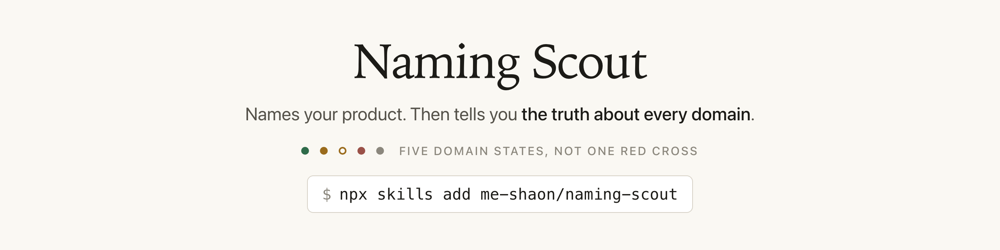

<picture>
  <source media="(prefers-color-scheme: dark)" srcset="assets/banner-dark.png">
  
</picture>

# Naming Scout

An agent skill for naming a startup, product, app, library or newsletter. It interviews you
about what you are building before generating anything, and works inside metaphor territories
rather than permuting your keywords.

Every candidate is then checked where it counts. Domains are read from the registry itself,
alongside the package registries and hand checks your project actually needs. A check that
failed is reported as failed, never as free.

Works in Claude Code, Cursor, Codex, OpenCode and 75 other agents.

## Why it is different

**A name generator gets one word from you. Naming Scout gets your whole situation.**

What you type into a generator:

```
budget
```

What you tell Naming Scout:

```
A budgeting app for freelancers. They earn £9,000 one month and £900 the
next. It works out a safe amount to pay yourself, so bad months stop hurting.
Freelancers will recommend it to other freelancers. UK and US.
```

It asks a few questions before it starts. Everything below comes from that difference.

**A generator only knows one word, so it can only add letters to it.**

| Name | What it is | The `.com` |
|---|---|---|
| `Budgetly` | "budget" plus "ly" | taken in 2011 |
| `Budgetify` | "budget" plus "ify" | taken in 2014 |
| `GetBudget` | "budget" plus "get" | taken in 2003 |

None of these says what your app does. And all of them are gone. Every generator looks in
the same small place, so that place is empty.

**Naming Scout knows what your app is for, so it can look for meaning.**

Your app stops bad months from hurting. A cushion is soft. It stops you getting hurt when you
fall. So it can reach names like these:

| Name | What it says to a customer | The `.com` |
|---|---|---|
| **Cash Cushion** | money that softens the fall in a bad month | for sale, held since 2003 |
| **Even Months** | every month pays you the same | free |

You get 8 to 15 names like this. Each one comes with a reason and a weakness. These two are
examples, not a promise.

**Then it tells you which one it would pick, and why.** Cash Cushion is the better name, but
you have to buy the domain. Even Months costs about $12 today.

Most generators never show you Cash Cushion at all. They only show names with a free domain,
so the better name never reaches you.

**It also knows which checks you need.**

You are building a phone app, so it checks the app stores, the trademark registers and the
social handles. It skips npm and PyPI, because nobody installs your app from a terminal. A
Python library gets the opposite. A newsletter gets neither.

A domain search cannot do this, because it never learns what you are building.

**Then it tells you the truth about every domain.**

Most tools show you a red cross. You learn nothing from a red cross. You get five answers
instead:

| Answer | What it means |
|---|---|
| **free** | Nobody owns it. Register it now. |
| **for sale** | Someone owns it and wants to sell it. |
| **parked** | Someone owns it. No website and no price. |
| **taken** | Someone owns it and uses it. |
| **not checked** | The check failed. This does not mean free. |

The last one matters most. Other tools show a failed check as a free domain. You find out
later, after you have chosen the name.

## It also does these

**It can name your product in your own language.** You are building a shop app in Dhaka. Ask
for Bangla names.

The two names you would reach for first are already gone:

| Name | What it means | The `.com` |
|---|---|---|
| Amar Dokan | my shop | taken in 2011 |
| Tali Khata | the tally book | taken in 2021 |

An app called TallyKhata already serves Bangladeshi shopkeepers, and `tallykhata.com` went in
2018. A generator would offer you that name and say nothing about it.

Naming Scout keeps going and finds names that are still free:

| Name | What it means | The `.com` |
|---|---|---|
| Baki Boi | the credit book | **free** |
| Khata Patra | ledger papers | **free** |

A shopkeeper in Dhaka understands these at once. An English name would need explaining.

It also checks every English spelling. Bangla is not written in English letters, so your
customers spell it in different ways. If you buy `amardokan.com` and a customer types
`amardukan.com`, they land on somebody else's website. All three spellings are taken, and
they were registered years apart:

| Spelling | Status |
|---|---|
| `amardokan.com` | taken in 2011 |
| `amardukan.com` | taken in 2018 |
| `amardokaan.com` | taken in 2022 |

It does this for Hindi, Urdu, Arabic, Turkish, Thai and Korean too.

**It knows that changing the spelling will not save you.** Your name is taken, so you think
about dropping a letter or swapping one. Everybody tries this:

| The name you wanted | The change you would make |
|---|---|
| `tracker.com` taken in 1994 | `trackr.com` for sale since 1997 |
| `builder.com` taken in 1997 | `buildr.com` taken in 2004 |
| `staticapi.com` for sale | `statikapi.com` taken in 2025 |

Someone always got there first, often twenty years earlier. A changed spelling also sends
your customers to the wrong website, because they type the spelling they know.

Naming Scout checks the changed spelling before you choose it. Then it looks for a better
answer. `staticapi.dev` is free.

Keep the spelling people know. Change the ending instead.

**It tells you if people can find you.** Every name gets one of three answers:

- **ownable.** Nothing else uses this name. You will be the first search result.
- **contested.** Other things share this name. You will need time and work.
- **crowded.** This name is a common word. You may never be first.

A name people cannot find costs you more than an expensive domain.

## What you get

A web page opens in your browser. The answer is at the top.

You see one recommended name, why it works, and the domain to buy. You also see the one thing
that would change the answer. Below that, two more names, then the full list.

The page is saved in `naming-reports/` where you ran it, so you can read it again next week
or send it to a co-founder. The data behind it is saved next to the page.

Every name comes with a weakness. If a name has no weakness listed, nobody checked it properly.

## What it checks

It checks these on its own:

- Domain names, at the registry
- GitHub usernames
- npm, PyPI, crates.io, RubyGems and Docker Hub package names

It helps you check these by hand, because they need judgement:

- Trademarks
- Search results
- App stores
- Social media handles

## Install

```bash
npx skills add me-shaon/naming-scout
```

Add `-g` to install it for every project rather than just the current one. You need `curl`
and `jq`. Optional: `export GITHUB_TOKEN=…` raises the GitHub check from 60 requests an hour
to 5,000.

## Real examples

Eight complete runs with real data: **[`naming-scout/examples/`](naming-scout/examples/)**

| Example | What it shows |
|---|---|
| [Startup](naming-scout/examples/saas-startup.md) | The normal case. A founder naming a product |
| [Your own language](naming-scout/examples/local-language.md) | Naming in Bangla for a Dhaka market |
| [Misspelling](naming-scout/examples/respelling.md) | `statik` instead of `static`, and why not |
| [Consumer brand](naming-scout/examples/consumer-product.md) | Where trademark is the real risk |
| [Buying a domain](naming-scout/examples/aftermarket.md) | A funded team willing to pay |
| [Newsletter](naming-scout/examples/newsletter.md) | Domain, social and search only |
| [A wrong start](naming-scout/examples/weak-first-direction.md) | The first idea fails and the work restarts |
| [Developer tool](naming-scout/examples/developer-tool.md) | Where npm and PyPI decide it |

Full guide: **[`naming-scout/README.md`](naming-scout/README.md)**

## What it cannot do

- **It cannot tell you a domain price.** No registry publishes prices. It tells you a listing
  exists and sends you there.
- **It cannot check every domain ending.** `.co` and most South Asian endings have no registry
  API. Those come back as "not checked".
- **It cannot check social handles.** The platforms give wrong answers, so it sends you to look.
- **It cannot clear a trademark.** It helps you search. That is not legal advice.

Before you spend money on a brand, ask a lawyer to do a trademark search in every country you
will sell in. Changing your name later costs far more.
